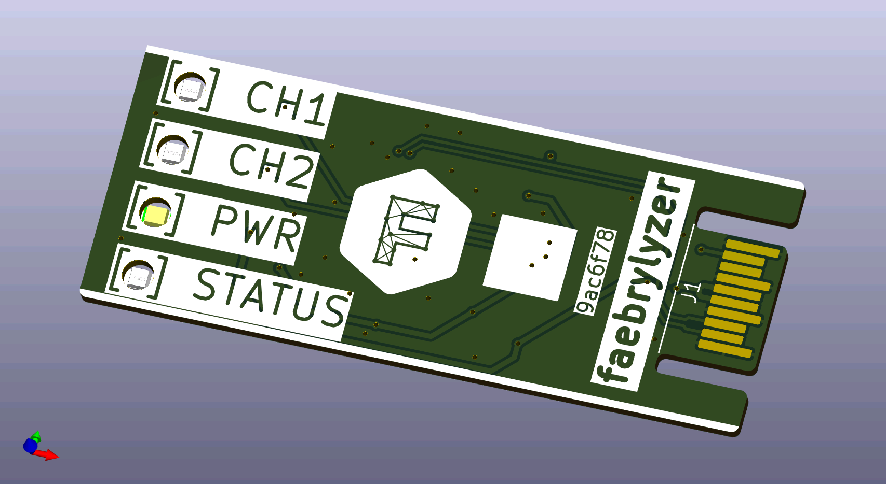

# faebrylyzer

 

8 channel logic analyser compatible with the fx2lafw firmware

     

## About

faebrylyzer is an 8 channel logic analyser compatible with the fx2lafw firmware. It is designed to be integrated as a module into other projects (e.g. a factory test rig).
This project is build with the open-source EDA [faebryk](https://github.com/faebryk/faebryk).

## Working with the source files

See [here](./docs/development.md) for the instructions on how to install and edit this project.

## Building

If you want to build the physical output of this project you can find the build instructions [here](./docs/build_instructions.md).

## Contributing

If you want to share your alterations, improvements, or add bugfixes to this project, please take a look at the [contributing guidelines](./docs/CONTRIBUTING.md).

## Community Support

Community support is provided via Discord; see the Resources below for details.

### Resources

- Source Code: [Github](https://github.com/ruben-iteng/faebrylyzer)
- Chat: Real-time chat happens in faebryk's Discord Server (chit-chat room for now). Use this Discord [Invite](https://discord.gg/95jYuPmnUW) to register
- Issues: [Issues](https://github.com/ruben-iteng/faebrylyzer/issues)
